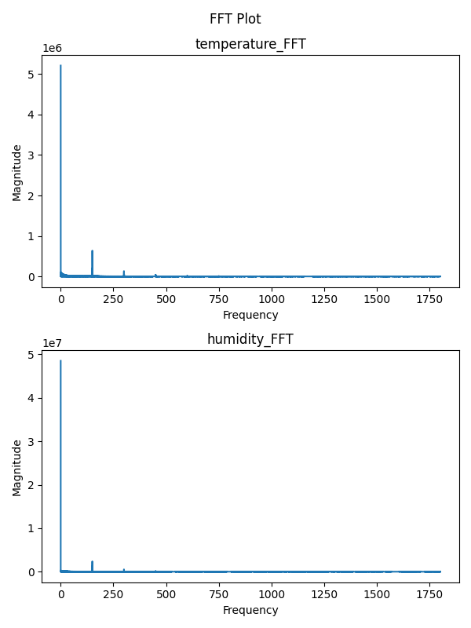

# discrete FFT

[](https://github.com/VForWaTer/tool_fft/actions/workflows/docker-image.yml)

This repository contains a generic FFT toot.
Performs a discrete fast Fourier transformation on numerical data. The data is accepted as a single-column
`dat` file, or as a `CSV` file. The tool will automatically ignore all non-numeric columns.

Note that the functions implemented here were almost entirely written by chatGPT as a test. 
All produced functions needed some human refactoring to get inputs and outputs right.

## How generic?

Tools using this template can be run by the [toolbox-runner](https://github.com/hydrocode-de/tool-runner). 
That is only convenience, the tools implemented using this template are independent of any framework.

The main idea is to implement a common file structure inside container to load inputs and outputs of the 
tool. The template available are: 

* [Python template](https://github.com/vforwater/tool_template_python)
* [R template](https://github.com/vforwater/tool_template_r)
* [NodeJS template](https://github.com/vforwater/tool_template_node)
* [Octave template](https://github.com/vforwater/tool_template_octave), 


Each container needs at least the following structure:

```
/
|- in/
|  |- parameters.json
|- out/
|  |- ...
|- src/
|  |- tool.yml
|  |- run.py
```

* `parameters.json` are parameters. Whichever framework runs the container, this is how parameters are passed.
* `tool.yml` is the tool specification. It contains metadata about the scope of the tool, the number of endpoints (functions) and their parameters
* `run.py` is the tool itself, or a Python script that handles the execution. It has to capture all outputs and either `print` them to console or create files in `/out`

## How to build the image?

You can build the image from within the root of this repo by
```
docker build -t tbr_fft .
```

Use any tag you like. If you want to run and manage the container with [toolbox-runner](https://github.com/hydrocode-de/tool-runner)
they should be prefixed by `tbr_` to be recognized. 

Alternatively, the contained `.github/workflows/docker-image.yml` will build the image for you 
on new releases on Github. You need to change the target repository in the aforementioned yaml.

## How to run?

This template installs the json2args python package to parse the parameters in the `/in/parameters.json`. This assumes that
the files are not renamed and not moved and there is actually only one tool in the container. For any other case, the environment variables
`PARAM_FILE` can be used to specify a new location for the `parameters.json` and `TOOL_RUN` can be used to specify the tool to be executed.
The `run.py` has to take care of that.

To invoke the docker container directly run something similar to:
```
docker run --rm -it -v /path/to/local/in:/in -v /path/to/local/out:/out -e TOOL_RUN=fft tbr_fft
```

Then, the output will be in your local out and based on your local input folder. Stdout and Stderr are also connected to the host.

With the [toolbox runner](https://github.com/hydrocode-de/tool-runner), this is simplyfied:

```python
from toolbox_runner import list_tools
import pandas as pd
tools = list_tools() # dict with tool names as keys

# load some data
df = pd.read_csv('in/series.csv')

foobar = tools.get('fft')  # it has to be present there...
foobar.run(result_path='./', data=df, timestep=3600)     # it's hourly data, so we want to scale the frequencies to 3600s periods
```
The example above will create a temporary file structure to be mounted into the container and then create a `.tar.gz` on termination of all 
inputs, outputs, specifications and some metadata, including the image sha256 used to create the output in the current working directory.
The result from the sample data should look like the plot below:




